# AdventureWorks 2022 Database - ERD Schema

## Overzicht
Dit document bevat een Entity Relationship Diagram (ERD) van de AdventureWorks 2022 database. De AdventureWorks database simuleert een fictief bedrijf dat actief is in de productie, distributie en verkoop van fietsen, onderdelen en accessoires.

## Database Schema's
De database is georganiseerd in de volgende schema's:
- **Person**: Persoons- en adresgegevens
- **HumanResources**: Werknemers, afdelingen en HR-gerelateerde informatie
- **Production**: Producten, categorieën, voorraad en productieprocessen
- **Sales**: Verkopen, klanten, bestellingen en verkoopgerelateerde gegevens
- **Purchasing**: Inkoop, leveranciers en inkooporders

## ERD Diagram

```mermaid
erDiagram
    %% Person Schema
    BusinessEntity {
        int BusinessEntityID PK
        uniqueidentifier rowguid
        datetime ModifiedDate
    }
    
    Person {
        int BusinessEntityID PK
        string PersonType
        string FirstName
        string MiddleName
        string LastName
        string EmailPromotion
        xml AdditionalContactInfo
        xml Demographics
        uniqueidentifier rowguid
        datetime ModifiedDate
    }
    
    EmailAddress {
        int BusinessEntityID PK
        int EmailAddressID PK
        string EmailAddress
        uniqueidentifier rowguid
        datetime ModifiedDate
    }
    
    PersonPhone {
        int BusinessEntityID PK
        string PhoneNumber PK
        int PhoneNumberTypeID PK
        datetime ModifiedDate
    }
    
    Address {
        int AddressID PK
        string AddressLine1
        string AddressLine2
        string City
        int StateProvinceID FK
        string PostalCode
        geography SpatialLocation
        uniqueidentifier rowguid
        datetime ModifiedDate
    }
    
    StateProvince {
        int StateProvinceID PK
        string StateProvinceCode
        string CountryRegionCode FK
        string Name
        int TerritoryID FK
        uniqueidentifier rowguid
        datetime ModifiedDate
    }
    
    CountryRegion {
        string CountryRegionCode PK
        string Name
        datetime ModifiedDate
    }
    
    BusinessEntityAddress {
        int BusinessEntityID PK
        int AddressID PK
        int AddressTypeID PK
        uniqueidentifier rowguid
        datetime ModifiedDate
    }
    
    %% HumanResources Schema
    Employee {
        int BusinessEntityID PK
        string NationalIDNumber
        string LoginID
        string JobTitle
        date BirthDate
        char MaritalStatus
        char Gender
        date HireDate
        bit SalariedFlag
        int VacationHours
        int SickLeaveHours
        bit CurrentFlag
        uniqueidentifier rowguid
        datetime ModifiedDate
    }
    
    Department {
        int DepartmentID PK
        string Name
        string GroupName
        datetime ModifiedDate
    }
    
    EmployeeDepartmentHistory {
        int BusinessEntityID PK
        int DepartmentID PK
        int ShiftID PK
        date StartDate PK
        date EndDate
        datetime ModifiedDate
    }
    
    %% Production Schema
    Product {
        int ProductID PK
        string Name
        string ProductNumber
        bit MakeFlag
        bit FinishedGoodsFlag
        string Color
        int SafetyStockLevel
        int ReorderPoint
        decimal StandardCost
        decimal ListPrice
        string Size
        string SizeUnitMeasureCode FK
        string WeightUnitMeasureCode FK
        decimal Weight
        int DaysToManufacture
        string ProductLine
        string Class
        string Style
        int ProductSubcategoryID FK
        int ProductModelID FK
        datetime SellStartDate
        datetime SellEndDate
        datetime DiscontinuedDate
        uniqueidentifier rowguid
        datetime ModifiedDate
    }
    
    ProductCategory {
        int ProductCategoryID PK
        string Name
        uniqueidentifier rowguid
        datetime ModifiedDate
    }
    
    ProductSubcategory {
        int ProductSubcategoryID PK
        int ProductCategoryID FK
        string Name
        uniqueidentifier rowguid
        datetime ModifiedDate
    }
    
    ProductModel {
        int ProductModelID PK
        string Name
        xml CatalogDescription
        xml Instructions
        uniqueidentifier rowguid
        datetime ModifiedDate
    }
    
    ProductInventory {
        int ProductID PK
        int LocationID PK
        string Shelf
        int Bin
        int Quantity
        uniqueidentifier rowguid
        datetime ModifiedDate
    }
    
    Location {
        int LocationID PK
        string Name
        decimal CostRate
        decimal Availability
        datetime ModifiedDate
    }
    
    %% Sales Schema
    Customer {
        int CustomerID PK
        int PersonID FK
        int StoreID FK
        int TerritoryID FK
        string AccountNumber
        uniqueidentifier rowguid
        datetime ModifiedDate
    }
    
    Store {
        int BusinessEntityID PK
        string Name
        int SalesPersonID FK
        xml Demographics
        uniqueidentifier rowguid
        datetime ModifiedDate
    }
    
    SalesOrderHeader {
        int SalesOrderID PK
        int RevisionNumber
        datetime OrderDate
        datetime DueDate
        datetime ShipDate
        int Status
        bit OnlineOrderFlag
        string SalesOrderNumber
        string PurchaseOrderNumber
        string AccountNumber
        int CustomerID FK
        int SalesPersonID FK
        int TerritoryID FK
        int BillToAddressID FK
        int ShipToAddressID FK
        int ShipMethodID FK
        int CreditCardID FK
        string CreditCardApprovalCode
        int CurrencyRateID FK
        decimal SubTotal
        decimal TaxAmt
        decimal Freight
        decimal TotalDue
        string Comment
        uniqueidentifier rowguid
        datetime ModifiedDate
    }
    
    SalesOrderDetail {
        int SalesOrderID PK
        int SalesOrderDetailID PK
        string CarrierTrackingNumber
        int OrderQty
        int ProductID FK
        int SpecialOfferID FK
        decimal UnitPrice
        decimal UnitPriceDiscount
        decimal LineTotal
        uniqueidentifier rowguid
        datetime ModifiedDate
    }
    
    SalesPerson {
        int BusinessEntityID PK
        int TerritoryID FK
        decimal SalesQuota
        decimal Bonus
        decimal CommissionPct
        decimal SalesYTD
        decimal SalesLastYear
        uniqueidentifier rowguid
        datetime ModifiedDate
    }
    
    SalesTerritory {
        int TerritoryID PK
        string Name
        string CountryRegionCode FK
        string Group
        decimal SalesYTD
        decimal SalesLastYear
        decimal CostYTD
        decimal CostLastYear
        uniqueidentifier rowguid
        datetime ModifiedDate
    }
    
    SpecialOffer {
        int SpecialOfferID PK
        string Description
        decimal DiscountPct
        string Type
        string Category
        datetime StartDate
        datetime EndDate
        int MinQty
        int MaxQty
        uniqueidentifier rowguid
        datetime ModifiedDate
    }
    
    SpecialOfferProduct {
        int SpecialOfferID PK
        int ProductID PK
        uniqueidentifier rowguid
        datetime ModifiedDate
    }
    
    %% Purchasing Schema
    Vendor {
        int BusinessEntityID PK
        string AccountNumber
        string Name
        int CreditRating
        bit PreferredVendorStatus
        bit ActiveFlag
        string PurchasingWebServiceURL
        datetime ModifiedDate
    }
    
    PurchaseOrderHeader {
        int PurchaseOrderID PK
        int RevisionNumber
        int Status
        int EmployeeID FK
        int VendorID FK
        int ShipMethodID FK
        datetime OrderDate
        datetime ShipDate
        decimal SubTotal
        decimal TaxAmt
        decimal Freight
        decimal TotalDue
        datetime ModifiedDate
    }
    
    PurchaseOrderDetail {
        int PurchaseOrderID PK
        int PurchaseOrderDetailID PK
        datetime DueDate
        int OrderQty
        int ProductID FK
        decimal UnitPrice
        decimal LineTotal
        int ReceivedQty
        int RejectedQty
        int StockedQty
        datetime ModifiedDate
    }
    
    %% Relationships
    BusinessEntity ||--o{ Person : "is"
    Person ||--o{ EmailAddress : "has"
    Person ||--o{ PersonPhone : "has"
    Person ||--o{ Employee : "can be"
    Person ||--o{ Customer : "can be"
    
    BusinessEntity ||--o{ BusinessEntityAddress : "has"
    Address ||--o{ BusinessEntityAddress : "is used in"
    Address }o--|| StateProvince : "located in"
    StateProvince }o--|| CountryRegion : "part of"
    StateProvince }o--|| SalesTerritory : "belongs to"
    
    Employee ||--o{ EmployeeDepartmentHistory : "works in"
    Department ||--o{ EmployeeDepartmentHistory : "employs"
    Employee ||--o{ SalesPerson : "can be"
    Employee ||--o{ PurchaseOrderHeader : "creates"
    
    ProductCategory ||--o{ ProductSubcategory : "contains"
    ProductSubcategory ||--o{ Product : "categorizes"
    ProductModel ||--o{ Product : "defines"
    Product ||--o{ ProductInventory : "stored in"
    Location ||--o{ ProductInventory : "stores"
    
    Customer ||--o{ SalesOrderHeader : "places"
    Person ||--o{ Customer : "can be"
    Store ||--o{ Customer : "can be"
    SalesPerson ||--o{ Customer : "manages"
    SalesPerson ||--o{ Store : "manages"
    SalesPerson ||--o{ SalesOrderHeader : "processes"
    SalesTerritory ||--o{ Customer : "serves"
    SalesTerritory ||--o{ SalesPerson : "assigned to"
    SalesTerritory ||--o{ SalesOrderHeader : "covers"
    
    SalesOrderHeader ||--o{ SalesOrderDetail : "contains"
    Product ||--o{ SalesOrderDetail : "sold in"
    SpecialOffer ||--o{ SpecialOfferProduct : "applies to"
    Product ||--o{ SpecialOfferProduct : "has offers"
    SpecialOfferProduct ||--o{ SalesOrderDetail : "used in"
    
    Address ||--o{ SalesOrderHeader : "bill to"
    Address ||--o{ SalesOrderHeader : "ship to"
    
    BusinessEntity ||--o{ Vendor : "is"
    Vendor ||--o{ PurchaseOrderHeader : "receives"
    PurchaseOrderHeader ||--o{ PurchaseOrderDetail : "contains"
    Product ||--o{ PurchaseOrderDetail : "purchased in"
    
    CountryRegion ||--o{ SalesTerritory : "contains"
```

## Belangrijke Relaties

### Personen en Organisaties
- **BusinessEntity** is de basis voor alle entiteiten (personen, leveranciers, winkels)
- **Person** bevat alle persoonlijke informatie
- **Employee** breidt Person uit met werknemersgegevens
- **Customer** kan zowel een persoon als een winkel zijn

### Producten en Voorraad
- **Product** is gekoppeld aan categorieën, modellen en voorraadlocaties
- **ProductCategory** → **ProductSubcategory** → **Product** hiërarchie
- **ProductInventory** houdt voorraadniveaus bij per locatie

### Verkoop
- **Customer** plaatst **SalesOrderHeader**
- **SalesOrderHeader** bevat meerdere **SalesOrderDetail** regels
- **SalesPerson** beheert klanten en verwerkt bestellingen
- **SpecialOffer** kunnen worden toegepast op producten via **SpecialOfferProduct**

### Inkoop
- **Vendor** levert producten via **PurchaseOrderHeader**
- **PurchaseOrderDetail** specificeert welke producten worden ingekocht
- **Employee** (inkopers) maken inkooporders aan

## Database Statistieken
- **Totaal aantal tabellen**: 71
- **Schema's**: 5 (Person, HumanResources, Production, Sales, Purchasing)
- **Foreign Key relaties**: 90+

Deze database biedt een uitgebreide dataset voor het leren van SQL, databaseontwerp en bedrijfsanalyse.
